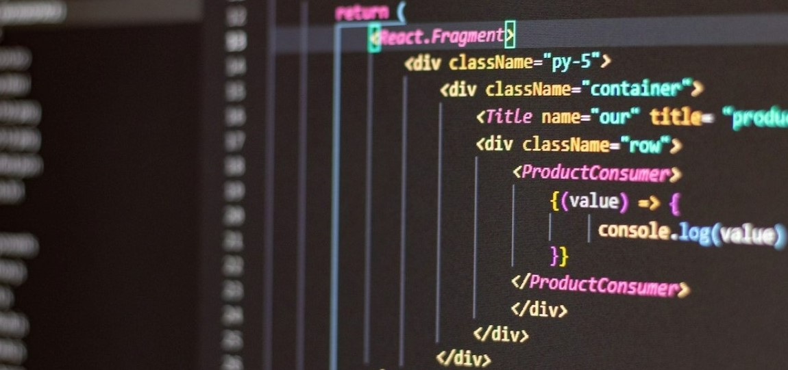

## About Me 

Hello, I'm Thelma Osifo, a software development student at MITT.

I’m invested in helping companies make informed business decisions leveraging on data. I also enjoy designing functional websites and applications that meet users needs.

My tech stack includes C#, .NET, JavaScript, CSS, SQL Server, and PowerBI. Want to know more about me? Reach out to me - osifothelma@gmail.com. 

## Tech Stack

## My stats

  

  

<!---
Thelma-Dev/Thelma-Dev is a ✨ special ✨ repository because its `README.md` (this file) appears on your GitHub profile.
You can click the Preview link to take a look at your changes.
--->
